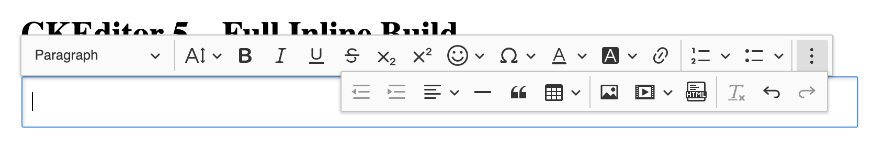

# CKEditor 5 Full Free Inline Build

Full free CKEditor5 inline build.



This build contains:

- All free editor features
- Customized font and table color spectrum (210 colors)
- Custom Emoji build
- Text to emoji convertion
- Sanitator for plugin HtmlEmbed implemented by DOMPurify
- Image margin correction for left and right aligment

Full Editor build is useful for making blog articles.

## Setup

To install it, run:

```javascript
npm i --save @phudak/ckeditor5-build-inline-full
```

Creating an editor using a CKEditor 5 build is very simple and can be described in two steps:

1. Load the desired editor via the `<script>` tag.
2. Call the static `create()` method to create the editor.

In your HTML page add an element that CKEditor should replace:

```html
<div id="editor"></div>
```

Load the editor build 

```html
<script src="... ckeditor5-build-inline-full/build/ckeditor.js"></script>
```

Call the editor

```html
<script>
    FullInlineEditor.create( document.querySelector( '#editor' ) )
        .then( editor => {
            window.editor = editor;
		} )
        .catch( error => {
            console.error( 'There was a problem initializing the editor.', error );
        } );
</script>
```

## CKEditor 5 Framework

CKEditor 5 Builds allow you to quickly and easily initialize one of the many types of editors in your application. At the same time, CKEditor 5 is also a framework for creating custom-made rich text editing solutions.

To find out how to start building your own editor from scratch go to [CKEditor 5 Framework overview section of CKEditor 5 documentation](https://ckeditor.com/docs/ckeditor5/latest/framework/guides/overview.html).


